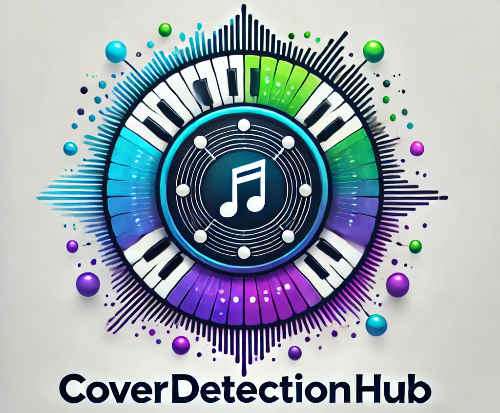

# CoverDetectionHub

<div align="center" width="100%">
   
</div>

Authors: Kamil Szczepanik, Dawid Ruciński, Piotr Kitłowski

---

## Project description


A framework and “hub” for **music cover identification**, enabling researchers to compare various CSI methods and run experiments through a user-friendly Gradio interface.

---

## Table of Contents
1. [Setup Instructions](#setup-instructions)
2. [Project Overview](#project-overview)
3. [Technology Stack](#technology-stack)
4. [Models Implemented](#models-implemented)
6. [Available Datasets](#available-datasets)
7. [Gradio App Usage](#gradio-app-usage)
8. [Experiments and Tests](#experiments-and-tests)
9. [Future Challenges](#future-challenges)
10. [Performance Metrics](#performance-metrics)
11. [Bibliography Review](#bibliography-review)


---

## Setup Instructions

1. **Clone or Download** this repository:
   ```bash
   git clone https://github.com/cncPomper/CoverDetectionHub.git --recurse-submodules
   cd CoverDetectionHub
   ```
   Note: **--recurse-submodules** is very important, as our hub compares various models that are stored in submodules.

2. Create and Activate a Virtual Environment (optional but recommended):
   ```bash
   # Create a virtual environment (Linux/macOS)
   python -m venv venv
   source venv/bin/activate

   # On Windows
   python -m venv venv
   venv\Scripts\activate
   ```

3. Install Dependencies:
   ```bash
   pip install -r requirements.txt
   ```

4. Download or Place Model Checkpoints:
 - Certain models (ByteCover, CoverHunter, Lyricover) require large checkpoint files that are not included in this repo. Here you will find checkpoints to download.
 - Update or create `configs/paths.yaml` to point to where you store these checkpoints.

5. Prepare Datasets:
  - Datasets are available to download here.
  - Update or create `configs/paths.yaml` to point to provide paths for datasets.

The config has been tested on Linux and Windows machines with CUDA. Please note you may need to install software from **Technology stack** section "Needed to run".
The checkpoints are stored [here](https://drive.google.com/drive/folders/1YMCLLi1HVybz_knO3yW-io0ul3AK_Ku5?usp=sharing).
## Project Overview

This project is part of a Music Information Retrieval (MIR) course. We developed a hub for cover detection, providing:

- A unified interface to compare different cover detection models.
- Experiments for evaluating effectiveness on known cover-song datasets.
- A fast, user-friendly GUI using Gradio.

### Original Scope
Initially, we planned to use the Da-TACOS dataset. However, we pivoted to using SHS100k for training models due to practical constraints. For experiments, we focus on Covers80 and synthetic datasets derived from it.

## Technology stack
Main technologies in use:
- **Python**: Our proposed technology stack is based on Python, considering its great capabilities for working with data in an easy way.
- **PyTorch**: Deep learning library.
- **Gradio**: User interface will be implemented in Gradio library, because it is a very convenient tool for a fast prototype building.
- **Numpy**: Library for maths operations.
- **Librosa**: Used for audio loading and some feature extraction (MFCC, spectral centroid) in the simpler comparison methods.
- **venv** (or other tool): For making the project portable in an easy way
- **OpenAI Whisper**: Used by Lyricover to transcribe lyrics and measure similarity in lyric space.

Other programs that are needed to run:
- [**ffmpeg**](https://github.com/FFmpeg/FFmpeg): Used for samples validation and simple preprocessing
- [**SoX**](https://github.com/chirlu/sox): Used for audio processing

## Models Implemented 
We currently have 3 main cover-detection models:

1. ByteCover:
- A neural-based approach, leveraging specialized embeddings for audio.
- Checkpoints are loaded from bytecover_checkpoint_path.
 
2. CoverHunter:
- Another deep learning–based model, configured via a YAML file and checkpoint directory.
- Paths in paths.yaml guide where to load the model weights.

3. Lyricover:
- Inspired by the paper "The Words Remain the Same: Cover Detection with Lyrics Transcription".
- It incorporates lyric transcription (via Whisper) and tonal features to gauge similarity.
Each of these models outputs a similarity score for a given pair of audio files. A threshold then decides if two songs are considered “covers.”

4. Re-move:
- From the paper "Less is more: Faster and better music version identification with embedding distillation" (https://arxiv.org/pdf/2010.03284).

### Feature Extraction Methods
Apart from the main deep-learning models, we also included two simpler methods for demonstration and baseline comparison:

- MFCC (Mel-Frequency Cepstral Coefficients)
- Spectral Centroid

These can be used to compare two audio files based on feature similarity (e.g., cosine similarity).

## Available Datasets
The hub includes references to the following datasets:

1. Covers80
A standard collection used in many cover-song identification studies.

2. Covers80but10
A smaller variant with only 10 songs (for quick testing).

3. Injected Abracadabra
A synthetic dataset where a portion of “Abracadabra” by Steve Miller Band is injected into other audio samples, as described in [Batlle-Roca et al.](https://arxiv.org/pdf/2407.14364).

**Note: The actual training of ByteCover, CoverHunter, and Lyricover was performed on SHS100k, using a university server with GPU machines. The Covers80-related datasets are primarily for testing and demonstration.**

### Training dataset

As described in this document, we decided mainly to use SHS100k dataset for training. We based on metadata [file](https://github.com/Orfium/bytecover/blob/master/data/interim/shs100k.csv) from [bytecover](https://github.com/Orfium/bytecover) repository. 

The dataset is organised into 9998 cliques (groups of different performances of a single sample; we consider all performances from one particular clique to be each other's cover). Each clique contains several samples. Additionally, there is provided the title of a song, its **YouTube video ID** and SecondHandSongs ID. We managed to obtain approximately 78k samples, whose size was **~270GB**.

For further processing, the main identification of each individual sample is its **YouTube video ID**.

## Gradio App Usage

After installing dependencies and ensuring your checkpoints/datasets exist:

Launch the Gradio interface:
   ```bash
   python gradio_app.py
   ```

A browser tab should open with two tabs:
1. Cover Song Identification
 - Upload two audio files (e.g., .mp3, formats from [python-soundfile](https://python-soundfile.readthedocs.io/en/0.11.0/) are supported), select a model (ByteCover, CoverHunter, Lyricover, MFCC, or Spectral Centroid), and set a threshold.
 - The interface will compute a similarity score and return whether it considers them covers.
2. Model Testing
   - Choose a CSI model (ByteCover, CoverHunter, MFCC, Spectral Centroid).
   - Pick a dataset (Covers80, Covers80but10, or Injected Abracadabra).
   - Select a threshold. The system then computes evaluation metrics (mAP, Precision@10, MR1, etc.) on that dataset, printing a summary.


## Experiments and Tests
1. Synthetic Injection (“Injected Abracadabra”)
   - Based on the partial injection method from [Batlle-Roca et al.](https://arxiv.org/pdf/2407.14364).
  - We inject a segment of an original piece (Abracadabra) into other tracks to create partial covers, then measure how well each model detects the covers.

2. Unit Tests
   - We maintain a `tests/` directory with `pytest` test files

## Bibliography Review

### Cover song detection methods

| **Paper**                | **Notes**                                                                 |
|-----------------------------------|-----------------------------------------------------------------------------|
| [CoverHunter: Cover Song Identification with Refined Attention and Alignments](https://arxiv.org/pdf/2306.09025) | Paper proposes new method for CSI task called CoverHunter. It explores features deeper with refined attention and alignments. It has 3 crucial modules: 1) Convolution-augumented transformer; 2) Attention-based time pooling module; 3) A novel training scheme. Authors share their excellent results, beating all existing methods at this time. They test in on benchmarks like DaTacos and SHS100K. In general, they propose a state-of-the-art model, which is definitely one of the current best, which is why it is worth including it in our project. PyTorch implementation of this method can be found in repository [CoverHunter](https://github.com/Liu-Feng-deeplearning/CoverHunter), along with checkpoints of pretrained models. |
| [BYTECOVER: COVER SONG IDENTIFICATION VIA MULTI-LOSS TRAINING](https://arxiv.org/pdf/2010.14022v2) | This paper from 2021 introduces new feature learning method for song cover identification task. It is built on a classical ResNet model with improvements designed for CSI. In a set of experiments, authors demonstrate its effectiveness and efficiency. They evaluate the method on multiple datasets, including DaTacos. In the repository [bytecover](https://github.com/Orfium/bytecover), there is a shared implementation of this method with the best-trained model checkpoints. Thoughts: There is no transformer in a method, which may imply worse results than CoverHunter. |
|[ESSENTIA: AN AUDIO ANALYSIS LIBRARY FOR MUSIC INFORMATION RETRIEVAL](https://www.researchgate.netpublication/256104772_ESSENTIA_an_Audio_Analysis_Library_for_Music_Information_Retrieval) | This paper describes a framework for multiple MIR applications. This tool consists of a number of reconfigurable modules that come in handy for researchers. For our case, an interesting approach is to use the harmonic pitch class profile and the chroma features of audio signals to calculate the similarity of two tracks. This model is very basic and well-known; therefore, it will serve as a reference. The used metric in this model is obtained from a binary cross similarity matrix, which could finally be transferred into a numeric value using a smith-waterman sequence alignment algorithm. **We dedcided to reproduce the experiments for embeddings using MFCC and spectral centroid, but using librosa library.** |
|[THE WORDS REMAIN THE SAME: COVER DETECTION WITH LYRICS TRANSCRIPTION](https://archives.ismir.net/ismir2021/paper/000089.pdf) | Some authors have other applications. In this paper, they proposed another approach, called the *Lyrics-recognition-based system and a classic tonal-based system*. The authors used datasets like Da-Tacos and DALI to detect the cover. Moreover, they used a few fusion models: 1) Lyrics recognition state-of-the-art framework obtained in MIREX 2020 and it uses a model *Time Delay Neural Network* (TDNN) trained using the English tracks of the DALI dataset. In the background music preprocessing step *Singing Voice Separation* (SVS). Moreover, the complete framework they used *Mel-Frequency Cepstral Coefficients* (MFCC) 2) To calculate the similarity between pairs of transcripts - String matching 3) Finally, they used Tonal-based cover detection which is called Re-MOVE and its training of dataset part of Da-Tacos. Another one, that is interesting is more classic HPCP features for cover detection. There has also been proposed joint approach implemented by us, [LyriCover](https://github.com/DawidRucinski/LyriCover). It joins the text retrieval with classic methods. |

### Datasets and benchmarks

| **Dataset**                | **Details**                                                                 |
|-----------------------------------|-----------------------------------------------------------------------------|
| Da-TACOS – <br>Dataset for Cover Song Identification<br> and Understanding <br> <li>[Da-TACOS Dataset Paper](https://archives.ismir.net/ismir2019/paper/000038.pdf)</li>  <br> <li>[Da-TACOS GitHub Repository](https://github.com/MTG/da-tacos)</li>  | Two subsets: <br> 1. Benchmark Subset (15,000 songs) <br> 2. Cover Analysis Subset (10,000 songs) <br> <br> <li>Annotations obtained with API from SecondHandSongs.com</li> <br> <li>Features extracted from MP3 audio files encoded at 44.1 kHz sample rate</li> <br> <li>**No audio files included, only pre-extracted features and metadata**</li> <br> <li>7 state-of-the-art CSI algorithms benchmarked on the Benchmark Subset</li> <br> <li>Cover Analysis Subset used to study modifiable musical characteristics  </li>   <br> Thoughts: This dataset has become a classic benchamark for testing CSI systems. Moreover, authors of the paper, along with the  dataset, also provided a  framework for feature extraction and benchmarking - [acoss: Audio Cover Song Suite](https://github.com/furkanyesiler/acoss). 'acoss' includes a standard feature extraction framework with audio features for CSI task and open source implementations of seven CSI algorithms. It was designed to facilitate the future work in this line of research. Although dataset in relatively new (2019), both repositories have not been updated since 5 years ago and considering how rapidly MIR domain develops - 5 years is a lot. That is why our project can be an attempt to create a refreshed and modern version of this framework. It would include state-of-the-art methods with hopefully additional datasets to test them. |
|  <br> [Covers80](http://labrosa.ee.columbia.edu/projects/coversongs/covers80/) |   <li>The dataset contains 80 songs, with 2 different performances of each song by different artists (160 tracks in total).  </li>   <br> <li>All audio files are encoded as 32 kbps MP3 (mono, 16 kHz sampling rate, bandwidth limited to 7 kHz). </li>  <br> Thoughts: We will not use the Covers80 dataset as primary dataset  because it is relatively small and is old (2007). Additionally, the audio files are of low quality (32 kbps, 16 kHz mono).The dataset was assembled somewhat randomly, and it may not provide the diversity or representativeness. However, it has become a CSI systems benchmark, that is why, if we have enough time, we will try to include it in out project. <br> Dataset appeared in a paper [THE 2007 LABROSA COVER SONG DETECTION SYSTEM](http://labrosa.ee.columbia.edu/~dpwe/pubs/EllisC07-covers.pdf). |
| [SHS100K](http://millionsongdataset.com/secondhand/) | <li> Contains metadata and audio features for a large number of songs and their covers. </li> <li> Includes a diverse range of musical genres </li>   <li> Metadata: song title, artist, release year </li><br> Thoughts: **This dataset served us as primary for training purposes** |
| [ZAIKS dataset](https://zaiks.org.pl/) | It's a friendly organization in Poland. The organization will provide a music dataset for testing purposes - these will probably be Polish songs and their famous cover versions. |


## Performance Metrics

### Dataset: Injected Abracadabra 

| Dataset / Model          | Mean Average Precision (mAP) | Precision at 10 (P@10) / mP@10 | Mean Rank of First Correct Cover (MR1 / mMR1) |
|--------------------------|------------------------------|---------------------------------|-----------------------------------------------|
| **Model: re-move**       | **0.86600**                 | 0.87500                         | 1.00000                                       |
| **Model: CoverHunter**   | 0.78400                     | 0.90000                         | 1.00000                                       |
| **Model: Lyricover**     | 0.82029                     | 0.90000                         | 1.00000                                       |
| **Model: ByteCover**     | 0.51435                     | 0.70000                         | 1.00000                                       |
| **MFCC**                 | 0.24015                     | 0.30000                         | 3.00000                                       |
| **Spectral Centroid**    | 0.24159                     | 0.30000                         | 3.00000                                       |

### Dataset: Covers80 

| Dataset / Model          | Mean Average Precision (mAP) | Precision at 10 (P@10) / mP@10 | Mean Rank of First Correct Cover (MR1 / mMR1) |
|--------------------------|------------------------------|---------------------------------|-----------------------------------------------|
| **Model: re-move**       | **0.83020**                 | 0.09695                         | 8.04268                                       |
| **Model: Lyricover**     | 0.83425                     | 0.09939                         | 7.41463                                       |
| **Model: CoverHunter**   | 0.74161                     | 0.09268                         | 9.52439                                       |
| **Model: ByteCover**     | 0.52172                     | 0.07927                         | 14.78049                                      |
| **MFCC**                 | 0.24015                     | 0.30000                         | 3.00000                                       |
| **Spectral Centroid**    | 0.04352                     | 0.00793                         | 76.80488                                      |

---

## Project schedule
### W1 (14-20.10.2024)

- [x] Gathering literature
- [x] preparing design proposal
- [x] tools selection
- [x] selection of datasets

### W2 (21-27.10.2024)

- [x] Preparing the environment
- [x] choice for the models
- [x] initial dataset preprocessing

### W3-W4 (28.10-10.11.2024)

- [x] Implementation of the first functional prototype
- [x] including training at least one model
- [x] minimal GUI

### W5-W6 (11-24.11.2024)

- [x] First results evaluation
- [x] implementing improvements
- [x] training
- [x] adding subsequent models
- [x] scraping SHS100K dataset

### W7 (25.11-1.12.2024)

- [x] Automated tests design
- [x] training of remaining models

### W8-W9 (02-15.12.2024)

- [x] Evaluation of the results
- [x] improving GUI
- [x] re-training the models if necessary

### W10-W12 (16.12.2024-05.01.2025)

- [x] Working on the final presentation
- [x] tests
- [x] gathering final results, Bożenarodzeniowy chill (optional)

### W13 (06-13.01.2025)

- [x] Final results evaluation
- [ ] preparation of the paper (?)

### W14 (13-19.01.2025)

:tada: Public project presentation :tada:

## Future challenges
- obtaining Da-Tacos dataset and possibly perform training and evaluation on it
- improving the [LyriCover](https://github.com/DawidRucinski/LyriCover) model for more sophisticated audio features exctraction; training on a larger subset of SHS100k after improving performance of the model
- possible co-operation with [ZAIKS](https://zaiks.org.pl/) to form a new dataset and deploy the solution
- performing more experiments, similar to "Injected Abracadabra" or others found in the literature
- augmentations are a very interesting field of experiments
