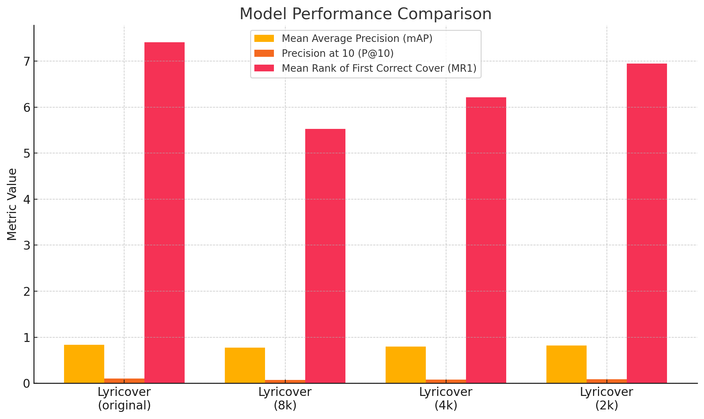

# CoverDetectionHub

<div align="center" width="100%">
   
</div>
Authors: Kamil Szczepanik, Dawid Ruciński, Piotr Kitłowski
Coauthors: Karol Kaspere, Wojciech Bożek, Mateusz Węcławski

---

## Project description


A framework and “hub” for **music cover identification**, enabling researchers to compare various CSI methods and run experiments through a user-friendly Gradio interface. Additionally, new update added generation of covers (instrumental and with lyrics).

---

## Table of Contents
1. [Setup Instructions](#setup-instructions)
2. [Project Overview](#project-overview)
3. [Technology Stack](#technology-stack)
4. [Models Implemented](#models-implemented)
6. [Available Datasets](#available-datasets)
7. [Gradio App Usage](#gradio-app-usage)
8. [Experiments and Tests](#experiments-and-tests)
9. [Future Challenges](#future-challenges)
10. [Performance Metrics](#performance-metrics)
11. [Bibliography Review](#bibliography-review)
12. [Unit Tests](#unit-tests)


---

## Setup Instructions

1. **Clone or Download** this repository:
   ```bash
   git clone https://github.com/cncPomper/CoverDetectionHub.git --recurse-submodules
   cd CoverDetectionHub
   ```
   Note: **--recurse-submodules** is very important, as our hub compares various models that are stored in submodules.

2. Create and Activate a Virtual Environment (optional but recommended):
   ```bash
   # Create a virtual environment (Linux/macOS)
   python -m venv venv # we recommend using python 3.10
   source venv/bin/activate

   # On Windows
   python -m venv venv
   venv\Scripts\activate
   ```

3. Install Dependencies:
   ```bash
   pip install -r requirements.txt
   ```

4. Download or Place Model Checkpoints:
 - Certain models (ByteCover, CoverHunter, Lyricover) require large checkpoint files that are not included in this repo. Here you will find checkpoints to download.
 - Update or create `configs/paths.yaml` to point to where you store these checkpoints.

5. Prepare Datasets:
  - Datasets are available to download here.
  - Update or create `configs/paths.yaml` to point to provide paths for datasets.

The config has been tested on Linux and Windows machines with CUDA. Please note you may need to install software from **Technology stack** section "Needed to run".
The checkpoints are stored [here](https://drive.google.com/drive/folders/1YMCLLi1HVybz_knO3yW-io0ul3AK_Ku5?usp=sharing).
## Project Overview

This project is part of a Music Information Retrieval (MIR) course. We developed a hub for cover detection and generation, providing:

- A unified interface to compare different cover detection models.
- A submodule with cover generation (instrumental and with lyrics)
- Experiments for evaluating effectiveness on known cover-song datasets.
- Experiments with augmentations for lyricover model
- A fast, user-friendly GUI using Gradio.

### Original Scope
Initially, we planned to use the Da-TACOS dataset. However, we pivoted to using SHS100k for training models due to practical constraints. For experiments, we focus on Covers80 and synthetic datasets derived from it.

## Technology stack
Main technologies in use:
- **Python**: Our proposed technology stack is based on Python, considering its great capabilities for working with data in an easy way.
- **PyTorch**: Deep learning library.
- **Gradio**: User interface will be implemented in Gradio library, because it is a very convenient tool for a fast prototype building.
- **Numpy**: Library for maths operations.
- **Librosa**: Used for audio loading and some feature extraction (MFCC, spectral centroid) in the simpler comparison methods.
- **venv** (or other tool): For making the project portable in an easy way
- **OpenAI Whisper**: Used by Lyricover to transcribe lyrics and measure similarity in lyric space.
- **demucs**: A source‐separation library that uses deep convolutional networks to isolate vocals and instruments from mixed audio.
- **MusicGen**: A generative model from Meta’s Audiocraft that produces high-quality instrumental music conditioned on input audio or prompts.
- **Audiomentations**: A Python library for applying real‐time, on‐the‐fly audio data augmentation (noise, pitch shift, time stretch, etc.) to improve model robustness during training.

Other programs that are needed to run:
- [**ffmpeg**](https://github.com/FFmpeg/FFmpeg): Used for samples validation and simple preprocessing
- [**SoX**](https://github.com/chirlu/sox): Used for audio processing

## Models Implemented 
We currently have 3 main cover-detection models:

1. ByteCover:
- A neural-based approach, leveraging specialized embeddings for audio.
- Checkpoints are loaded from bytecover_checkpoint_path.
 
2. CoverHunter:
- Another deep learning–based model, configured via a YAML file and checkpoint directory.
- Paths in paths.yaml guide where to load the model weights.

3. [LyriCover](https://github.com/DawidRucinski/LyriCover):
- Inspired by the paper "The Words Remain the Same: Cover Detection with Lyrics Transcription".
- It is our **own implementation** joining text extraction using OpenAI Whisper with n-gram representation and spectral features.
- The result is obtained via a simple neural network that joins the predictions.

Each of these models outputs a similarity score for a given pair of audio files. A threshold then decides if two songs are considered “covers.”

4. Re-move:
- From the paper "Less is more: Faster and better music version identification with embedding distillation" (https://arxiv.org/pdf/2010.03284).
- It was training with a feature that compute "convolutional and recurrent estimators for music analysis" (CREMA)
- The model is lightweight and training fast

### Feature Extraction Methods
Apart from the main deep-learning models, we also included two simpler methods for demonstration and baseline comparison:

- MFCC (Mel-Frequency Cepstral Coefficients)
- Spectral Centroid

These can be used to compare two audio files based on feature similarity (e.g., cosine similarity).

## Available Datasets
The hub includes references to the following datasets:

1. Covers80:
A standard collection used in many cover-song identification studies.

1. Covers80but10:
A smaller variant with only 10 songs (for quick testing).

1. Injected Abracadabra
A synthetic dataset where a portion of “Abracadabra” by Steve Miller Band is injected into other audio samples, as described in [Batlle-Roca et al.](https://arxiv.org/pdf/2407.14364).

1. Distracted dataset
A synthetic dataset where during the original song there is an another song playing in background.

1. Da-tacos dataset
Dataset for covers identification. https://github.com/MTG/da-tacos

**Note: The actual training of ByteCover, CoverHunter, Remove and Lyricover was performed on SHS100k, using a university server with GPU machines. The Covers80-related datasets are primarily for testing and demonstration.**

### Training dataset

As described in this document, we decided mainly to use SHS100k dataset for training. We based on metadata [file](https://github.com/Orfium/bytecover/blob/master/data/interim/shs100k.csv) from [bytecover](https://github.com/Orfium/bytecover) repository. 

The dataset is organised into 9998 cliques (groups of different performances of a single sample; we consider all performances from one particular clique to be each other's cover). Each clique contains several samples. Additionally, there is provided the title of a song, its **YouTube video ID** and SecondHandSongs ID. We managed to obtain approximately 78k samples, whose size was **~300GB** (Some were deleted, approx ~30GB).

For further processing, the main identification of each individual sample is its **YouTube video ID**.

## Gradio App Usage

After installing dependencies and ensuring your checkpoints/datasets exist:

Launch the Gradio interface:
   ```bash
   python gradio_app.py
   ```

A browser tab should open with two tabs:
1. Cover Song Identification
 - Upload two audio files (e.g., .mp3, formats from [python-soundfile](https://python-soundfile.readthedocs.io/en/0.11.0/) are supported), select a model (ByteCover, CoverHunter, Lyricover, Remove, MFCC, or Spectral Centroid), and set a threshold.
 - The interface will compute a similarity score and return whether it considers them covers.
2. Model Testing
   - Choose a CSI model (ByteCover, CoverHunter, Remove, MFCC, Spectral Centroid).
   - Pick a dataset (Covers80, Covers80but10, or Injected Abracadabra).
   - Select a threshold. The system then computes evaluation metrics (mAP, Precision@10, MR1, etc.) on that dataset, printing a summary.


## Performed experiments
1. Synthetic Injection (“Injected Abracadabra”)
   - Based on the partial injection method from [Batlle-Roca et al.](https://arxiv.org/pdf/2407.14364).
  - We inject a segment of an original piece (Abracadabra) into other tracks to create partial covers, then measure how well each model detects the covers.
2. Covers80 evaluation - the samples were compared on a "pairwise" basis, i.e., pairs of tracks were selected either from the same groups (in which case they were considered covers) or from different groups (in which case they were classified as non-covers).
3. Synthetic Distracted Dataset
   - Our own implementation of new dataset. We are adding a background song to original one. 

## Unit Tests

We maintain a `tests/` directory with `pytest` test files. Below is a summary of the test coverage:

### Path Validation
- **`test_paths_exist`**: Verifies that all paths in `configs/paths.yaml` exist and match their expected type (directory or file).

### Covers80 Dataset Integrity
- **`test_gather_covers80_dataset_files`**: Ensures `gather_covers80_dataset_files` returns a non-empty list of `(audio_path, label)` tuples.
- **`test_covers80_random_subfolders_have_two_mp3s`**: Randomly checks subfolders in `covers80_data_dir` for at least two `.mp3` files.
- **`test_gather_covers80but10_dataset_files`**: Similar to the above but for a dataset variant.
- **`test_covers80but10_random_subfolders_have_two_mp3s`**: Verifies subfolders in `covers80but10_data_dir` contain at least two `.mp3` files.

### Ranking Metrics
- **`test_compute_metrics_for_ranking_no_relevant`**: Tests metrics when no relevant items are in the ranking.
- **`test_compute_metrics_for_ranking_all_relevant`**: Tests metrics when all items in the ranking are relevant.
- **`test_compute_metrics_for_ranking_mixed`**: Validates metrics for mixed relevant and irrelevant items.
- **`test_compute_mean_metrics_for_rankings_empty`**: Ensures mean metrics for an empty ranking set return 0.
- **`test_compute_mean_metrics_for_rankings_single`**: Verifies mean metrics match individual metrics for a single ranking.
- **`test_compute_mean_metrics_for_rankings_multiple`**: Validates mean metrics across multiple rankings against manual calculations.


## Bibliography Review

### Cover song detection methods

| **Paper**                | **Notes**                                                                 |
|-----------------------------------|-----------------------------------------------------------------------------|
| [CoverHunter: Cover Song Identification with Refined Attention and Alignments](https://arxiv.org/pdf/2306.09025) | Paper proposes new method for CSI task called CoverHunter. It explores features deeper with refined attention and alignments. It has 3 crucial modules: 1) Convolution-augumented transformer; 2) Attention-based time pooling module; 3) A novel training scheme. Authors share their excellent results, beating all existing methods at this time. They test in on benchmarks like DaTacos and SHS100K. In general, they propose a state-of-the-art model, which is definitely one of the current best, which is why it is worth including it in our project. PyTorch implementation of this method can be found in repository [CoverHunter](https://github.com/Liu-Feng-deeplearning/CoverHunter), along with checkpoints of pretrained models. |
| [BYTECOVER: COVER SONG IDENTIFICATION VIA MULTI-LOSS TRAINING](https://arxiv.org/pdf/2010.14022v2) | This paper from 2021 introduces new feature learning method for song cover identification task. It is built on a classical ResNet model with improvements designed for CSI. In a set of experiments, authors demonstrate its effectiveness and efficiency. They evaluate the method on multiple datasets, including DaTacos. In the repository [bytecover](https://github.com/Orfium/bytecover), there is a shared implementation of this method with the best-trained model checkpoints. Thoughts: There is no transformer in a method, which may imply worse results than CoverHunter. |
|[ESSENTIA: AN AUDIO ANALYSIS LIBRARY FOR MUSIC INFORMATION RETRIEVAL](https://www.researchgate.netpublication/256104772_ESSENTIA_an_Audio_Analysis_Library_for_Music_Information_Retrieval) | This paper describes a framework for multiple MIR applications. This tool consists of a number of reconfigurable modules that come in handy for researchers. For our case, an interesting approach is to use the harmonic pitch class profile and the chroma features of audio signals to calculate the similarity of two tracks. This model is very basic and well-known; therefore, it will serve as a reference. The used metric in this model is obtained from a binary cross similarity matrix, which could finally be transferred into a numeric value using a smith-waterman sequence alignment algorithm. **We dedcided to reproduce the experiments for embeddings using MFCC and spectral centroid, but using librosa library.** |
|[THE WORDS REMAIN THE SAME: COVER DETECTION WITH LYRICS TRANSCRIPTION](https://archives.ismir.net/ismir2021/paper/000089.pdf) | Some authors have other applications. In this paper, they proposed another approach, called the *Lyrics-recognition-based system and a classic tonal-based system*. The authors used datasets like Da-Tacos and DALI to detect the cover. Moreover, they used a few fusion models: 1) Lyrics recognition state-of-the-art framework obtained in MIREX 2020 and it uses a model *Time Delay Neural Network* (TDNN) trained using the English tracks of the DALI dataset. In the background music preprocessing step *Singing Voice Separation* (SVS). Moreover, the complete framework they used *Mel-Frequency Cepstral Coefficients* (MFCC) 2) To calculate the similarity between pairs of transcripts - String matching 3) Finally, they used Tonal-based cover detection which is called Re-MOVE and its training of dataset part of Da-Tacos. Another one, that is interesting is more classic HPCP features for cover detection. There has also been proposed joint approach implemented by us, [LyriCover](https://github.com/DawidRucinski/LyriCover). It joins the text retrieval with classic methods. |

### Datasets and benchmarks

| **Dataset**                | **Details**                                                                 |
|-----------------------------------|-----------------------------------------------------------------------------|
| Da-TACOS – <br>Dataset for Cover Song Identification<br> and Understanding <br> <li>[Da-TACOS Dataset Paper](https://archives.ismir.net/ismir2019/paper/000038.pdf)</li>  <br> <li>[Da-TACOS GitHub Repository](https://github.com/MTG/da-tacos)</li>  | Two subsets: <br> 1. Benchmark Subset (15,000 songs) <br> 2. Cover Analysis Subset (10,000 songs) <br> <br> <li>Annotations obtained with API from SecondHandSongs.com</li> <br> <li>Features extracted from MP3 audio files encoded at 44.1 kHz sample rate</li> <br> <li>**No audio files included, only pre-extracted features and metadata**</li> <br> <li>7 state-of-the-art CSI algorithms benchmarked on the Benchmark Subset</li> <br> <li>Cover Analysis Subset used to study modifiable musical characteristics  </li>   <br> Thoughts: This dataset has become a classic benchamark for testing CSI systems. Moreover, authors of the paper, along with the  dataset, also provided a  framework for feature extraction and benchmarking - [acoss: Audio Cover Song Suite](https://github.com/furkanyesiler/acoss). 'acoss' includes a standard feature extraction framework with audio features for CSI task and open source implementations of seven CSI algorithms. It was designed to facilitate the future work in this line of research. Although dataset in relatively new (2019), both repositories have not been updated since 5 years ago and considering how rapidly MIR domain develops - 5 years is a lot. That is why our project can be an attempt to create a refreshed and modern version of this framework. It would include state-of-the-art methods with hopefully additional datasets to test them. |
|  <br> [Covers80](http://labrosa.ee.columbia.edu/projects/coversongs/covers80/) |   <li>The dataset contains 80 songs, with 2 different performances of each song by different artists (160 tracks in total).  </li>   <br> <li>All audio files are encoded as 32 kbps MP3 (mono, 16 kHz sampling rate, bandwidth limited to 7 kHz). </li>  <br> Thoughts: We will not use the Covers80 dataset as primary dataset  because it is relatively small and is old (2007). Additionally, the audio files are of low quality (32 kbps, 16 kHz mono).The dataset was assembled somewhat randomly, and it may not provide the diversity or representativeness. However, it has become a CSI systems benchmark, that is why, if we have enough time, we will try to include it in out project. <br> Dataset appeared in a paper [THE 2007 LABROSA COVER SONG DETECTION SYSTEM](http://labrosa.ee.columbia.edu/~dpwe/pubs/EllisC07-covers.pdf). |
| [SHS100K](http://millionsongdataset.com/secondhand/) | <li> Contains metadata and audio features for a large number of songs and their covers. </li> <li> Includes a diverse range of musical genres </li>   <li> Metadata: song title, artist, release year </li><br> Thoughts: **This dataset served us as primary for training purposes** |
| [ZAIKS dataset](https://zaiks.org.pl/) | It's a friendly organization in Poland. The organization will provide a music dataset for testing purposes - these will probably be Polish songs and their famous cover versions. |


### Augmentations and further research - looking for methods used in CSI for further development of the project
| **Paper**                | **Notes**                                                                 |
|-----------------------------------|-----------------------------------------------------------------------------|
| [Training audio transformers for cover song identification](https://asmp-eurasipjournals.springeropen.com/articles/10.1186/s13636-023-00297-4#Sec12) | In this paper data augmentations are described in detail, providing an example that we can base our work on. Augmentations conducted by the research team include: randomly changing pitch dimension beetwen 0 to 11 bins, modifing tempo variation, duplication or removal of frames, as well as truncating some parts of the audio signal. |
| [WideResNet with Joint Representation Learning and Data Augmentation for Cover Song Identification](https://www.isca-archive.org/interspeech_2022/hu22f_interspeech.pdf) | In this paper few more augmentation techniques are presented. One of method is implemented by cropping input features with varriant lengths in order to accommodate input feature withf different length, another is based on masking vertical and horizontal bins. Those are called frequency and time masking.  |
|[A SEMI-SUPERVISED DEEP LEARNING APPROACH TO DATASET COLLECTION FOR QUERY-BY-HUMMING TASK](https://archives.ismir.net/ismir2023/paper/000077.pdf) | While this paper focuses on MIR methods used for Query-by-humming task (recognizing music piece by humming its part) and development of dataset designed for that problem, it is treated as a specialization of CSI problem by the authors. As such it provides interesting read that may be beneficial in terms of finding new experiments and refinements for our project. Besides it presents another set of augmentations and experiments that were conducted by reserchers and as such can be treated as yet another inspiration in further development. |


## Performance Metrics

The selection of metrics is based on Mirex Cover Song Identification Contest.

### Dataset: Injected Abracadabra 

| Dataset / Model          | Mean Average Precision (mAP) | Precision at 10 (P@10) / mP@10 | Mean Rank of First Correct Cover (MR1 / mMR1) |
|--------------------------|------------------------------|---------------------------------|-----------------------------------------------|
| **Model: re-move**       | **0.86600**                 | 0.87500                         | 1.00000                                       |
| **Model: CoverHunter**   | 0.78400                     | 0.90000                         | 1.00000                                       |
| **Model: Lyricover**     | 0.82029                     | 0.90000                         | 1.00000                                       |
| **Model: ByteCover**     | 0.51435                     | 0.70000                         | 1.00000                                       |
| **MFCC**                 | 0.24015                     | 0.30000                         | 3.00000                                       |
| **Spectral Centroid**    | 0.24159                     | 0.30000                         | 3.00000                                       |
| **Model: Augmented Lyricover**    | 0.88648                     | 0.90000                         | 1.00000                                     |

### Dataset: Covers80 

| Dataset / Model          | Mean Average Precision (mAP) | Precision at 10 (P@10) / mP@10 | Mean Rank of First Correct Cover (MR1 / mMR1) |
|--------------------------|------------------------------|---------------------------------|-----------------------------------------------|
| **Model: re-move**       | **0.83020**                 | 0.09695                         | 8.04268                                       |
| **Model: Lyricover**     | 0.83425                     | 0.09939                         | 7.41463                                       |
| **Model: CoverHunter**   | 0.74161                     | 0.09268                         | 9.52439                                       |
| **Model: ByteCover**     | 0.52172                     | 0.07927                         | 14.78049                                      |
| **MFCC**                 | 0.24015                     | 0.30000                         | 3.00000                                       |
| **Spectral Centroid**    | 0.04352                     | 0.00793                         | 76.80488                                      |
| **Model: Augmented Lyricover**    | 0.80529                    | 0.09939                        | 4.98780                                      |

### Dataset: Distracted Dataset 

| Dataset / Model          | Mean Average Precision (mAP) | Precision at 10 (P@10) / mP@10 | Mean Rank of First Correct Cover (MR1 / mMR1) |
|--------------------------|------------------------------|---------------------------------|-----------------------------------------------|
| **Model: re-move**       | **0.32454**                 | 0.07349                         | 19.48                                      |
| **Model: Lyricover**     | 0.25801                     | 0.05749                        | 44.14                                      |
| **Model: Augmented Lyricover**     | 0.26876                    | 0.05299                        | 41.69                                      |
| **Model: CoverHunter**   | 0.27697                     | 0.05799                         | 28.77                                       |
| **Model: ByteCover**     | 0.16761                     | 0.03299                         | 47.42                                         |
| **MFCC**                 | 0.04621                     | 0.01200                         | 93.935                                       |

## Tests on bigger subset of shs100k dataset

### Dataset: Covers80 

| Dataset / Model          | Mean Average Precision (mAP) | Precision at 10 (P@10) / mP@10 | Mean Rank of First Correct Cover (MR1 / mMR1) |
|--------------------------|------------------------------|---------------------------------|-----------------------------------------------|
| **Model: Lyricover**     | 0.83425                     | 0.09939                         | 7.41463                                       |
| **Model: Lyricover on bigger dataset (8k)**  | 0.77214                    | 0.07215                        | 5.53153                                     |
| **Model: Lyricover on bigger dataset (4k)**  | 0.79251                    | 0.07984                    | 6.21521
| **Model: Lyricover on bigger dataset (2k)**  | 0.81652                  | 0.08812                        | 6.95124    



## Why Larger Dataset Didn’t Improve Lyricover

- **Data Quality vs. Quantity**  
  Additional examples likely introduced noise (mismatched genres, poor recordings) that diluted the model’s signal.

- **Limited Feature Space**  
  Using only tonal cosine similarity and basic lyric cosine similarity cannot capture nuanced cover relationships as data diversity grows.

- **Model Capacity Mismatch**  
  A small 3-layer NN may underfit on more varied data unless re-architected or re-tuned (learning rate, regularization).

- **Imbalanced Sampling**  
  Adding many negatives without balancing positives can push down precision and mAP, even if overall accuracy remains stable.

---

## Concise Future Directions

1. **Richer Features**  
   - Use multi-scale tonal embeddings (e.g., short-term and long-term chroma).  
   - Replace raw lyric cosine with contextual text embeddings (e.g., Sentence-BERT).

2. **Stronger Models & Losses**  
   - Adopt a dual-branch network: one branch for audio embeddings (e.g., small CNN on mel spectrogram), another for lyric embeddings; fuse before classification.  
   - Switch to contrastive or triplet loss so covers cluster in embedding space, boosting mAP and P@10 directly.

3. **Data Curation & Sampling**  
   - Filter out noisy/mislabeled pairs automatically (e.g., check vocal separation confidence, validate lyric alignment).  
   - Ensure balanced positive vs. hard-negative sampling (hard negatives are non-covers with similar chords or themes).

4. **Transfer Learning & Pretrained Embeddings**  
   - Leverage pretrained audio models (e.g., OpenL3, VGGish) for richer audio features.  
   - Pretrain a small multimodal network (audio + lyrics) on a larger external covers dataset, then fine-tune on Covers80.

5. **Rank-Aware Objectives**  
   - Optimize a differentiable ranking loss (e.g., soft mAP) to directly improve P@10.  
   - Use margin ranking loss to minimize the mean rank of the first correct cover (MR1).

## Lyricover with augmentations

As for 2025L WIMU semester course augmentations experimentations were performed. The Lyricover Model was enhanced with custom DataLoader, that allows for extracting features each epoch, robusting augmentation pipeline, assuring that each epoch training set differs a little bit.

Furthermore W&B framework was implemented into the code, allowing for more robust experimentation tracking, saving model configuration, logging events and weights of the model after each run. 

We conducted several experiments, testing the dataset with different number of augmentations, measuring their effect on the model performence. Our initial strategyu was to perform fine tuning with augmentations on new training data and compare the effects of new learning. However due to taking too much epochs and too large of a learning rate we overfitted the model in initial experimentation phase. After lowering number of epochs and limiting learining rate we conducted further experimentations on larger pool of augmentations. 

## Augmented Lyricover Evaluation


Here we present effects of the augmentations on the model we received after experiments with augmentations.

For example on test dataset after training our model received following score:

| Metric     | Value   |
|------------|---------|
| Accuracy   | 0.8650  |
| Precision  | 1.0000  |
| Recall     | 0.7286  |
| F1 Score   | 0.8430  |

While original model received:

| Metric     | Value   |
|------------|---------|
| Accuracy   | 0.8725  |
| Precision  | 0.8524  |
| Recall     | 0.8995  |
| F1 Score   | 0.8753  |

Another evaluation was conducted on dataset which was augmented with minor augmentations (pitch shift, time stretch and clipping_distortion). Our augmented model metrics are presented below:

| Metric     | Value   |
|------------|---------|
| Accuracy   | 0.7788  |
| Precision  | 1.0000  |
| Recall     | 0.5589  |
| F1 Score   | 0.7171  |

and original model for comparisson:

| Metric     | Value   |
|------------|---------|
| Accuracy   | 0.7838  |
| Precision  | 0.9075  |
| Recall     | 0.6331  |
| F1 Score   | 0.7458  |


Judging by the F1 score, the overall performance of the model was lowered.
On datasets available for evaluation on CoverDetectionHub as well as our new Test called DistractedDataset (where clean audio is sompared with it's cover, where additional audio plays constantly in the background of cover song, momentarly increasing it's volume to match the volume of first song) our model performed slightly better on Inejcted Abracadabra set. It was also better in general in terms of Mean Avarage Precision and Mean rank of first relevant item.

Lyricover trained with augmentations
| Dataset               | mAP     | mP@10   | mMR1   |
|-----------------------|---------|---------|--------|
| Injected Abracadabra  | 0.88648 | 0.90000 | 1.00000 |
| Covers80              | 0.80529 | 0.09939 | 4.98780 |
| Distracted Dataset    | 0.26877 | 0.05300 | 41.69000 |

Original Lyricover
| Dataset               | mAP     | mP@10   | mMR1    |
|-----------------------|---------|---------|---------|
| Injected Abracadabra  | 0.82029 | 0.90000 | 1.00000 |
| Covers80              | 0.83425 | 0.09939 | 7.41463 |
| Distracted Dataset    | 0.25801 | 0.05750 | 44.14000 |

For more information about this experiment: 
https://github.com/wojtekBozek/LyriCover.git

## Future challenges
- better extracting similarity from features in Da-Tacos dataset. Arrays are long 12x2000, calculating median, average etc. It's not working (in some arrays there is a lot of 0 (or near to 0) that have bad impact at those values). We also tried DWT and similarity matrix. Similarity matrix could be a good solution, but it needs a lot of RAM and disk space - probably needs some optimizations. (features: croma_cens, crema, hpcp, mfcc_htk)
- currently, model Re-Move uses `essentia` package, which unavailable on Windows. This makes the whole app runnable only on unix operating systems. It would be advisable to make own implementation of the necessary methods from this package so that it app is runnable on all systems.
- the audio in the generated covers can sound somewhat robotic. It would be beneficial to work on generating a more natural-sounding voice, for example by leveraging the Retrieval-based Voice Conversion WebUI project: https://github.com/RVC-Project/Retrieval-based-Voice-Conversion-WebUI
- we recomend conducting further experimenations on sets of augmentations, but with lyrics generated each time.
- another possible addition would be exploring torchaudio library and whisper model parraller options in order to make feature extraction more robust. (lyricover)


## Useful Links

 - [Checkpoints and datasets](https://drive.google.com/drive/folders/19fAW7Nmk4CwncsfHQkrAYQ0fSFgcEHsw) - dataasets and checkopints
 - [augmented lyricover model checkpoint](https://drive.google.com/file/d/10UvcPfOJhAIfoUp1jze8jl-7V6ysD7oU/view?usp=drive_link)
 - [Distracted Dataset](https://drive.google.com/file/d/134V7bc82_P-wG4jMNEoE08HbsImQQtVD/view?usp=drive_link)

 
The logo has been designed using DALL-E model.